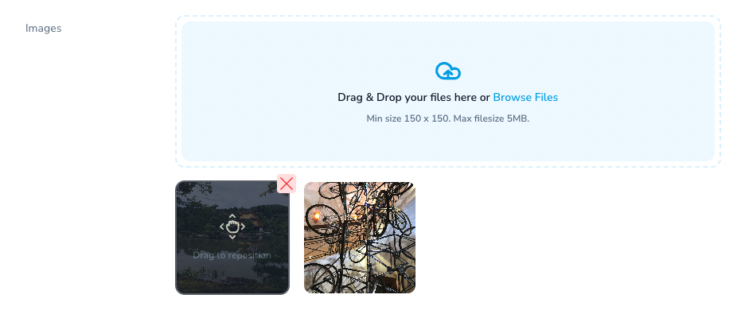

# Laravel Nova Image Gallery Field

<p align="center">
    
</p>

> A custom Nova field that allows multiple image upload with sorting

[](https://packagist.org/packages/ardenthq/nova-image-gallery-field) [](https://packagist.org/packages/ardenthq/nova-image-gallery-field) [](https://packagist.org/packages/ardenthq/nova-image-gallery-field)

## Features

-   For Laravel Nova ^4.0
-   Multiple image upload into a `spatie/laravel-medialibrary` collection.
-   Image sorting
-   Custom Image Validation
-   Drag & Drop
-   Dark Mode

<p align="center">
    
</p>

## Installation

```console
composer require ardenthq/nova-image-gallery-field
```

### Requirements

-   PHP ^8.0
-   [Laravel](https://laravel.com/)
-   [Laravel Nova ^4.22](https://nova.laravel.com/), for lower versions see the [Compatibility Branch](#compatibility-branch)
-   [Laravel Media Library](https://spatie.be/docs/laravel-medialibrary)

## Use

> **Note**
> This package reuses part of the logic used on the `Laravel\Nova\Fields\Trix` Field to store and handle files. This means we need to follow some steps that are mentioned on the [Laravel Nova docs](https://nova.laravel.com/docs/1.0/resources/fields.html#file-uploads) related to adding the migrations and pruning the files.

1. Define two database tables to store pending and persisted Trix uploads. To do so, create a migration with the following table definitions:

```php
Schema::create('nova_pending_field_attachments', function (Blueprint $table) {
    $table->increments('id');
    $table->string('draft_id')->index();
    $table->string('attachment');
    $table->string('original_name');
    $table->string('disk');
    $table->timestamps();
});

Schema::create('nova_field_attachments', function (Blueprint $table) {
    $table->increments('id');
    $table->string('attachable_type');
    $table->unsignedInteger('attachable_id');
    $table->string('attachment');
    $table->string('disk');
    $table->string('url')->index();
    $table->timestamps();

    $table->index(['attachable_type', 'attachable_id']);
});
```

**Note**: latest nova already includes these migrations. If so, you might receive error `Table already exists` while running migrations. In this case, you might only need to add `original_name` field in `nova_pending_field_attachments`:

```php
Schema::table('nova_pending_field_attachments', function (Blueprint $table) {
    $table->string('original_name')->after('attachment');
});
```

2. In your `app/Console/Kernel.php` file, you should register a daily job to prune any stale attachments from the pending attachments table and storage. Laravel Nova provides the job implementation needed to accomplish this:

```php
use Laravel\Nova\Trix\PruneStaleAttachments;

$schedule->call(function () {
    (new PruneStaleAttachments)();
})->daily();
```

3. Add the `ImageGalleryField` field to your Nova Resource.

4. Consider that the images will be stored in a `Spatie\MediaLibrary\MediaCollections\Models\Media` collection according to the name passed as the first parameter on the field `make` method or the second parameter if set. _(Dont forget to [register a media collection in your model](https://spatie.be/docs/laravel-medialibrary/working-with-media-collections/defining-media-collections))_

5. Use the `rules()` method to define the rules used for every single image.

6. Use the `rulesMessages()` method to define custom validation messages for the image rules.

7. Use the `help()` method if you want to place "help" text inside the Drag & Drop area.

### Example

```php
<?php
namespace App\Nova;

use Laravel\Nova\Http\Requests\NovaRequest;
use Laravel\Nova\Resource;
use Ardenthq\ImageGalleryField\ImageGalleryField;

final class ResourceName extends Resource
{
    // ....
    public function fields(NovaRequest $request)
    {
        return [
            // ....
            ImageGalleryField::make('Images')
                ->rules('mimes:jpeg,png,jpg,gif', 'dimensions:min_width=150,min_height=150', 'max:5000')
                ->rulesMessages([
                    'mimes'      => 'You must use a valid jpeg, png, jpg or gif image.',
                    'max'        => 'The image must be less than 5MB.',
                    'dimensions' => 'The image must be at least 150px wide and 150px tall.',
                ])
                ->help('Min size 150 x 150. Max filesize 5MB.')
                // Optional: add this method if you want to show the first image
                // of the gallery on the index page
                ->showOnIndex(),
                // ...
        ];
    }
    // ...
}
```

## Compatibility Branch

Due to changes made to the `Trix` fields in Nova 4.22, this package does not support lower Nova v4 versions on the `main` branch. If you want to use this package on an older Nova version, please see the `nova-compatibility` branch in this repostitory and use that to install the package through composer: `composer require ardenthq/nova-image-gallery-field:dev-nova-compatibility`

## Development

1. Run `yarn nova:install` and `yarn install` to install all the necessary dependencies for compiling the view components.
2. Run `yarn run dev` (or `yarn run watch`) while making changes to the components in your local environment.
3. If you change the vue components, ensure to compile for production before making a PR.

### Compile for production

1. Run `yarn nova:install` and `yarn install` to install all the necessary dependencies for compiling the view components.
2. Run `yarn run production`.

### Analyze the code with `phpstan`

```bash
composer analyse
```

### Refactor the code with php `rector`

```bash
composer refactor
```

### Format the code with `php-cs-fixer`

```bash
composer format
```

### Run tests

```bash
composer test
```

## Security

If you discover a security vulnerability within this package, please send an e-mail to security@ardenthq.com. All security vulnerabilities will be promptly addressed.

## Credits

This project exists thanks to all the people who [contribute](../../contributors).

## License

[MIT](LICENSE) © [Ardent](https://ardenthq.com)
